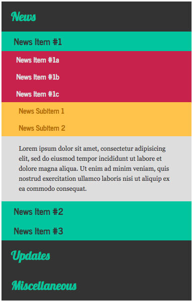
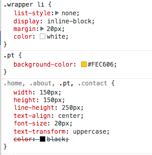
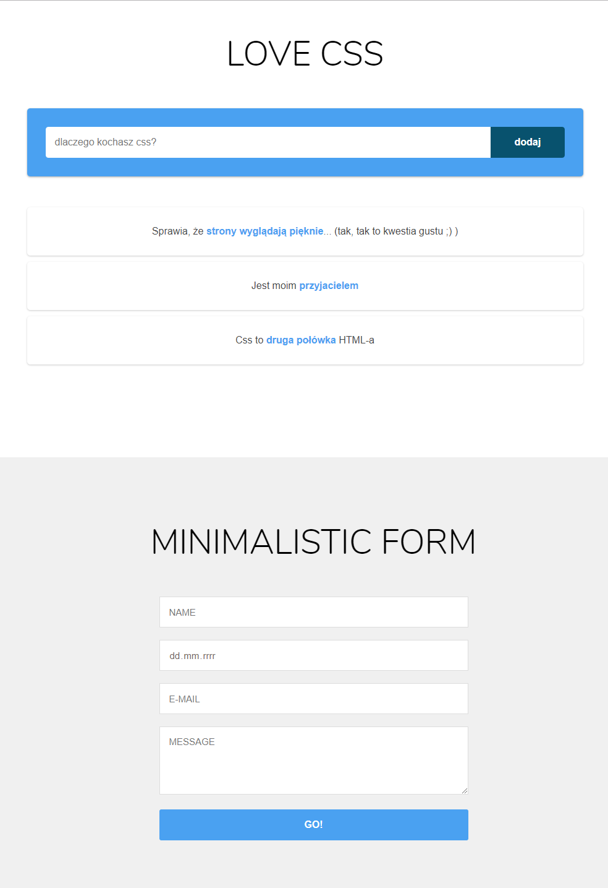

# CSS &ndash; Selektory


## Zadania rozwiązywane z wykładowcą

###  Panel wiadomości

Otwórz plik ```zadanie1.html```. Znajdziesz tam kod HTML panelu z przykładowymi newsami.
Niestety panuje tu lekki chaos. Postaraj się wykonać poniższe kroki, tak aby widok z newsami był bardziej przyjazny. Skoncentruj się na tym jak ustawiane są selektory. Zadanie rozwiąż w pliku ```zadanie1.css```

* Zresetuj margin i padding dla wszystkich elementów korzystając z selektora uniwersalnego ```*```
    > Dzięki temu wszystkie elementy "zbliżą" się do siebie.

* Nagłówkom ```h1, h2, h3, h4``` ustaw właściwość ```cursor: pointer```. Pamiętaj, aby zrobić to tylko dla nagłówków wewnątrz elementu ```accordion```.
    > Dzięki temu po najechaniu na nie myszką, zmieni się ikona kursora.

* Ustaw właściwość ```display: none``` dla wszystkich divów **oraz** dla wszystkich paragrafów wewnątrz elementu ```accordion```.
    > Dzięki temu wszystkie elementy oprócz nagłówków h1 powinny być zwinięte.

* Niektóre elementy w HTML mają ustawioną klasę ```opened```. Ustaw dla tych elementów właściwość ```display: block```.
  > Dzięki temu niektóre elementy będą rozwinięte.

Po wykonaniu poleceń panel wiadomości powinien wyglądać tak:



-------------------------------------------------------------------------------

## Zadania do samodzielnego wykonania

### Zadanie 2. Menu (~ 7min - 10min)

Otwórz plik ```zadanie2.html```. Znajduje się w nim proste menu. Twoim zadaniem jest ostylowanie go zgodnie z następującymi krokami:

* Zresetuj margin i padding dla wszystkich elementów korzystając z selektora uniwersalnego ```*```

* Ustaw kolor dla tła ```#003343```

* Dla wszsytkich elementów ```li```, które znajdują się wewnątrz elementu ```wrapper``` ustaw następujące właściwości:
```CSS
    list-style: none;
    display: inline-block;
    margin: 20px;
    color: white;
```


* Ustaw poniższą regułę w pliku css
```CSS
.home, .about, .pt, .contact {
    width: 150px;
    height: 150px;
    line-height: 250px;
    text-align: center;
    color: black;
    font-size: 20px;
    text-transform: uppercase;
}
```

* Ustaw elementom ```li```, które posiadają klasy następujący kolor tła:
    * home - ```#3D8EB9```
    * about - ```#71BA51```
    * pt - ```#FEC606```
    * contact - ```#E75926```

*  Zastanów się dlaczego kolor czcionki w boxach nie zmienił się na czarny?
Spójrz na rysunek niżej i postaraj się wytłumaczyć dlaczego? Otwórz Chrome Developer Tools i spróbuj zbadać problem, a następnie go napraw.




### Zadanie 3. Formularz (~ 10min - 15min)

Otwórz plik ```zadanie3.html```, znajdują się tam dwie sekcje z formularzami. Obie sekcje są ostylowane w pliku ```zadanie3.css```. Jednak pierwszy ma zakomentowane reguły css, które nie mają wpisanych selektorów. Zaczynając od 1 punktu uzupełnij selektory tak, aby pisane przez ciebie reguły nie zmieniły stylowania drugiego formularza.

Efekt końcowy: 


### Zadanie dodatkowe  
Poćwicz selektory na tej stronie (pierwsze 14 lekcji):
[flukeout.github.io](http://flukeout.github.io/ )
