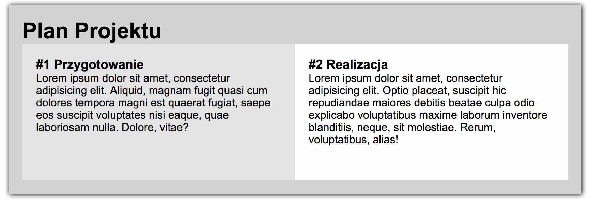
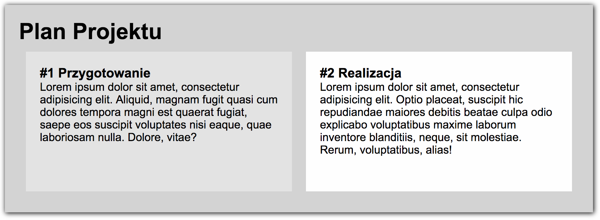

# CSS &ndash; Box Sizing

> Zadania rozwiązuj w plikach ```index.html``` oraz ```css/style.css```

## Zadania rozwiązywane z wykładowcą

### Nie mieszczące się elementy (~ 4min - 6min)

* Stwórz **div** o klasie **container** i ustaw mu niebieskie obramowanie oraz szerokość 400px.
* Stwórz wewnątrz niego element **div** o klasie **one** i:
    * ustaw mu szerokości po __350px__,
    * wyznacz ich granicę obrysem (np. ```border: 1px solid red```),
* Do stworzonego  **diva** o klasie **one** wpisz kilka słów. Następnie odsuń tekst od krawędzi **diva**. Czy widzisz, że przy ustawianiu paddingu element o klasie **one** nie mieści się w elemencie o klasie **container**?
* Zniweluj to powiększanie.


-------------------------------------------------------------------------------

## Zadania do samodzielnego wykonania

### Zadanie 1. Wizualizacja Box Sizing (~ 2min - 4min)
Przetestuj jak zmieniają się wielkości boxa, przy różnych ustawieniach box-sizing oraz podczas zmien szerkości, paddingów i borderu
[Interaktywny diagram box sizing](http://codepen.io/carolineartz/full/ogVXZj/).

### Zadanie 2. Za szeroki modal (~3min - 5min)

Marek jest naszym klientem i zlecił programiście zrobienie prostego modala o szerokości 400px. Niestety kod, który otrzymał, jest wadliwy. Marek zgłosił problem, że modal jest za szeroki. Zbadaj odpowiedni element w debugerze, a następnie rozwiąż problem w pliku **card.html** oraz **card.css**.

### Zadanie 3. Poprawki w planie projektu (~5min - 10min)

W plikach **plan.html** i **plan.css** znajduje się przepis pieczenia ciasta. Dopisz kod, aby tekst wewnątrz divów o klasach `card__column-left` i `card__column-right` miał 20px odstępu od krawędzi tych divów. Dodatkowo dodaj obramowanie tym elementom.



### Zadanie 4. Poprawki c.d. **dla zaawansowanych** (~5min - 10min)

Do poprzedniego zadania dodaj margines między divami (pionowy i poziomy), wynoszący 20px. Skorzystaj z metody `calc()`. https://developer.mozilla.org/en-US/docs/Web/CSS/calc


