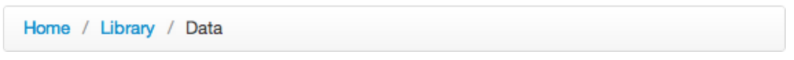

# CSS &ndash; Pseudoklasy i pseudoelementy


> Zadania rozwiązuj w plikach ```index.html``` oraz ```css/style.css```
> Do zadania z wykładowcą skorzystaj z pliku `navigation.html` oraz `css/navigation.css`

## Zadania rozwiązywane z wykładowcą

### Nawigacja (~10min - 15min)

W pliku **navigation.html** oraz **navigation.css** jest stworzona nawigacja. Dorób do niej następujące funkcjonalności:

* Po najechaniu na myszką na element nawigacji, zmień tło najechanego elementu na kolor #E3E3E3
* Obecna lista ma problem. Nie jest do końca wyśrodkowana. Wynika to z ustawionego marginu na każdym elemencie listy. Popraw buga w taki sposób, żeby lista była idealnie na środku (za pomocą **:last-child**)
* Każdy element listy powinien mieć swój ozdobnik (przewrócony czarny kwadrat o wielkości 5x5px).

Efekt końcowy:


-------------------------------------------------------------------------------

## Zadania do samodzielnego wykonania


### Zadanie 1. Gra w Selektory

Zagraj w grę [flukeout.github.io](http://flukeout.github.io/).

### Zadanie 2. Menu poziome breadcrumb (~ 10min - 15min)

Stwórz menu poziome typu breadcrumb. Po najechaniu na element listy, tekst powinien zmienić kolor (z niebieskiego na czarny). Powinno ono wyglądać następująco:



### Zadanie 3. Komentarz na stronie (~ 5min - 7min)
W pliku **html** stwórz **div** z przykładowym tekstem i obrazkiem (avatarem). Avatar wstaw jako pseudoelement before. Strona do przykładowych avatarów: https://findicons.com/pack/1072/face_avatars

Ostyluj go następująco:


