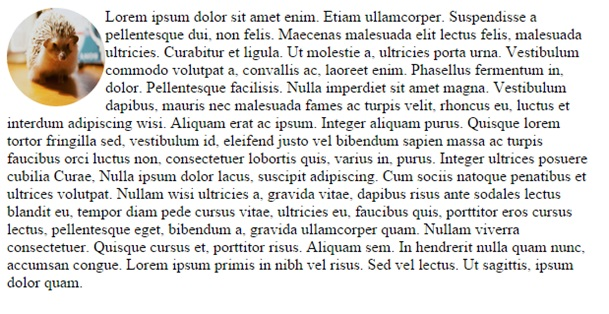
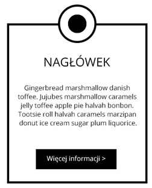

# CSS &ndash; Pozycjonowanie elementów

> Zadania rozwiązuj w plikach ```index.html``` oraz ```css/style.css```
> Do zadania z wykładowcą skorzystaj z pliku ```card.html``` oraz ```css/card.css```.
> Do zadania 5 skorzystaj z pliku ```dropdown.html``` oraz ```css/dropdown.css```.

## Zadania rozwiązywane z wykładowcą

### Zaproszenia na wesele (~ 10min - 15min)

Marysia i Adam szykują zaproszenia na swoje wesele. Zabrakło im czasu na ostatnie poprawki. Za pomocą **position** stwórz kółka, które udekorują kartkę (w każdym rogu powinno znaleźć się złote kółko o wymiarach 30x30 px).


Zadanie wykonaj w pliku `card.html` oraz `card.css`.

-------------------------------------------------------------------------------

## Zadania do samodzielnego wykonania

### Zadanie 1. Przypomnienie pozycjonowania (~ 4min - 6min)
Ustaw obrazek w taki sposób jak pokazano poniżej. Obrazek znajdziesz w katalogu **images**. Plik nazywa się ```jez.jpg```. Użyj do tego właściwości **float**.



### Zadanie 2. Pozycje (~ 4min - 6min)
Obrazek z poprzedniego zadania przesuń według schematu poniżej. Użyj do tego właściwości **position**.


### Zadanie 3. Trzeci wymiar (~ 4min - 6min)
Stwórz w osobnym elemencie **div** dwa obrazki (mogą być takie same). Ustaw im właściwości **z-index** tak jak poniżej.


### Zadanie 4. Zakładka (~ 8min - 10min)

Stwórz następujący układ. Wykorzystaj do tego właściwość **position**.



### Zadanie 5. Menu dropdown (~ 10min - 15min)

Zapoznaj się z przykładami z pozycjonowania elementów na stronie http://learnlayout.com/position.html.
Następnie za pomocą zdobytej wiedzy wykonaj menu dropdown, wyglądające w poniższy sposób.


Dropdown ma być przyczepiony na stałe do piewszego elementu listy (**Usługi**).

Zadanie wykonaj w pliku `dropdown.html` oraz `dropdown.css`.

### Zadanie 6. Menu dropdown c.d. (~ 15min - 20min) **Dla zaawansowanych**

Za pomocą stanu :hover, chowaj i wyświetlaj dropdown w taki sposób, że ma się on pokazywać po najechaniu myszką na napis **Usługi**, natomiast po zjechaniu myszką ma on zniknąć.

Spróbuj rozwijać menu w taki sposób, aby animowała się jego wysokość. (Użyj do tego właściwości transition).
