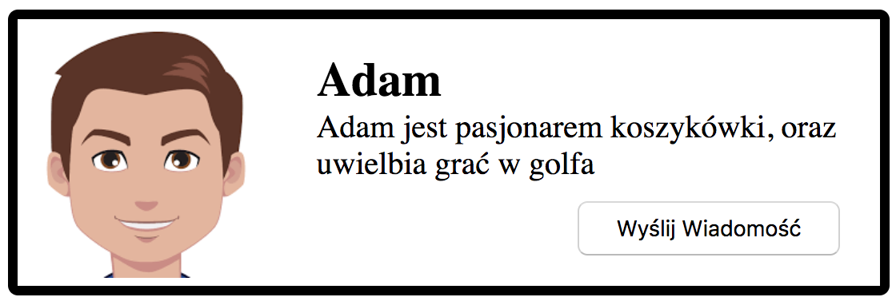
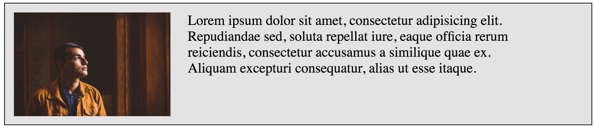
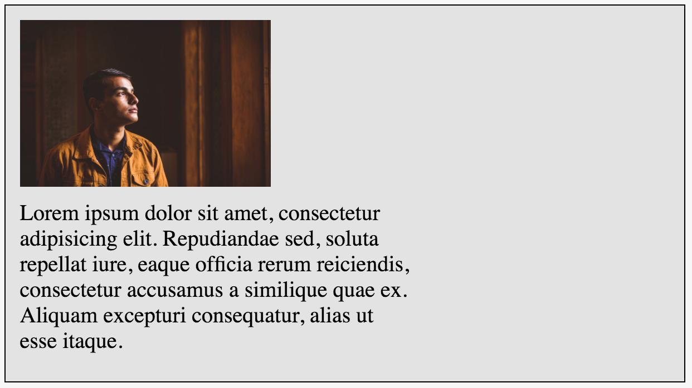
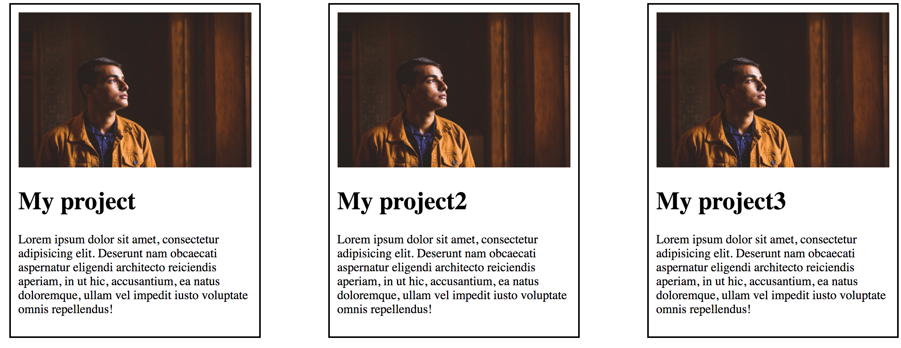
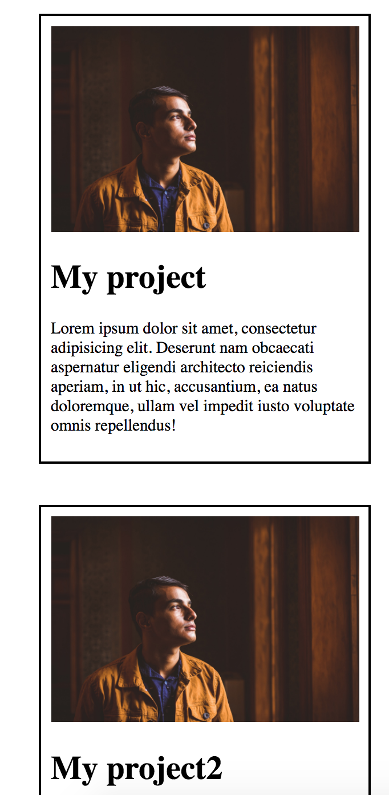

# CSS &ndash; Flexbox

## Zadania rozwiązywane z wykładowcą

### Notyfikacja (~15min - 20min)

Zadanie wykonaj w plikach `notification.html` i `notification.css`. Przy pomocy flexboxa stwórz poniższy element na stronie internetowej:

Wytyczne:

* Obrazek jest wycentrowany pionowo względem tekstu
* Przycisk `Wyślij wiadomość` znajduje się w prawym dolnym rogu boksa (użyj flexboxa).

### Prosta wizytówka (~15min - 20min)

Zadanie wykonaj w plikach `card.html` i `card.css`. Twoim zadaniem stworzenie wizytówki wyglądającej w ten sposób:

Wytyczne:

* Tworząc strony internetowe nie możemy doprowadzić do sytuacji, że w jednej linii tekstu mamy 4 słowa. Taki tekst jest wtedy nieczytelny. Spraw, aby tekst zawijał się pod zdjęciem, w momencie w którym nie mieści się obok zdjęcia. Powinno to wyglądać w taki sposób:

* Potestuj właściwość flex-direction i flex-wrap. Spraw, żeby zdjęcie było tym razem z prawej strony, oraz żeby zdjęcie w momencie zawijania było na dole.

-------------------------------------------------------------------------------

## Zadania do samodzielnego wykonania

### Nawigacja (~15min - 20min)

Zadanie wykonaj w plikach `index.html` i `style.css`. Korzystając z wiedzy dotyczącej jak układać elementy na stronie wykonaj poniższy układ strony.

Wytyczne:

* Do ustawiania elementów obok siebie użyj flexboxa
* Logo i nawigacja muszą być rozstrzelone (czyli być maksymalnie oddalone od siebie)
* Logo i nawigacja muszą być na środku headera (wyśrodkowane w pionie)

Dodatkowe informacje:

* kolor tła: #E53C3D
* kolor tekstu: #492F41

### Sekcja portfolio na stronie (~10min - 15min)

Zadanie wykonaj w plikach `portfolio.html` i `portfolio.css`. Stwórz poniższą sekcję przy użyciu flexboxa:

Wytyczne:

* Przy zmniejszaniu okna przeglądarki elementy mają spadać pod siebie i być na środku strony. Poniżej przykład ilustrujący tę sytuację:

